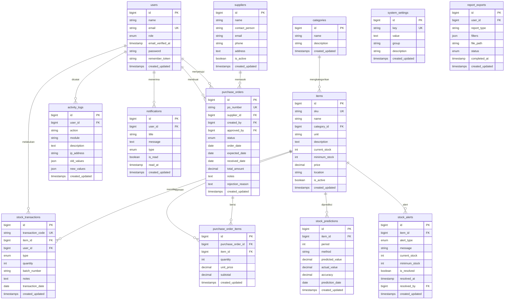
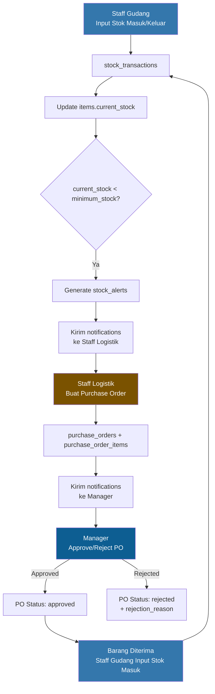

# Skema Database — PWI Industrial OS (web-oas)

## Ringkasan Analisis Project

Berdasarkan review menyeluruh terhadap project dan session `ses_27f3`, berikut temuan utama:

| Aspek | Detail |
|-------|--------|
| **Framework** | Laravel 10 + Vite + Tailwind CSS + Alpine.js |
| **Auth** | Laravel Breeze + Sanctum |
| **Database** | MySQL (`db_oas`) |
| **4 Role Aktor** | `admin`, `manager`, `staff_gudang`, `staff_logistik` |

### Fitur per Role (dari session)

| Role | Fitur Akses |
|------|-------------|
| **Admin** | Dashboard, Manajemen User, Master Data Barang, Log Aktivitas, Konfigurasi Sistem |
| **Staff Gudang** | Dashboard Gudang, Input Stok Masuk, Input Stok Keluar, Data Barang (view), Riwayat Transaksi |
| **Staff Logistik** | Dashboard Logistik, Prediksi Stok (SMA), Notifikasi Stok Rendah, Buat Purchase Order, Laporan Inventaris |
| **Manager** | Dashboard Eksekutif, Laporan Inventaris, Grafik Prediksi Stok, Persetujuan PO, Ekspor Data Laporan |

### Halaman yang Sudah Dibuat (Frontend Only)

- ✅ Login, Register, Forgot Password (custom design)
- ✅ Dashboard layout + dynamic sidebar (per role)
- ✅ Placeholder views: `admin/*`, `gudang/*`, `logistik/*`, `manager/*`
- ✅ Routes sudah didefinisikan di `web.php`
- ⚠️ **Belum ada migration untuk tabel bisnis** (hanya `users` + `role`)

---

## Skema Database Lengkap

Berikut adalah skema database yang dibutuhkan untuk mendukung seluruh fitur web OAS secara keseluruhan.

### Diagram ERD



---

## Detail Tabel

### 1. `users` — Pengguna Sistem

> [!NOTE]
> Tabel ini sudah ada (migration default Laravel + migration `add_role_to_users_table`). Tidak perlu membuat ulang.

```sql
-- Existing structure (sudah ada)
CREATE TABLE users (
    id              BIGINT UNSIGNED AUTO_INCREMENT PRIMARY KEY,
    name            VARCHAR(255) NOT NULL,
    email           VARCHAR(255) NOT NULL UNIQUE,
    role            ENUM('admin','manager','staff_gudang','staff_logistik') DEFAULT 'staff_gudang',
    email_verified_at TIMESTAMP NULL,
    password        VARCHAR(255) NOT NULL,
    remember_token  VARCHAR(100) NULL,
    created_at      TIMESTAMP NULL,
    updated_at      TIMESTAMP NULL
);
```

---

### 2. `categories` — Kategori Barang

Mengelompokkan barang/material berdasarkan jenis (misal: Lem, Kain, Aksesoris, Packaging, dll).

```sql
CREATE TABLE categories (
    id              BIGINT UNSIGNED AUTO_INCREMENT PRIMARY KEY,
    name            VARCHAR(255) NOT NULL,
    description     TEXT NULL,
    created_at      TIMESTAMP NULL,
    updated_at      TIMESTAMP NULL
);
```

**Digunakan di:** Master Data Barang (Admin), Data Barang (Staff Gudang)

---

### 3. `items` — Master Data Barang

Menyimpan data lengkap setiap item/material yang dikelola di gudang.

```sql
CREATE TABLE items (
    id              BIGINT UNSIGNED AUTO_INCREMENT PRIMARY KEY,
    sku             VARCHAR(50) NOT NULL UNIQUE,          -- Contoh: SKU-PW-9823
    name            VARCHAR(255) NOT NULL,
    category_id     BIGINT UNSIGNED NULL,
    unit            VARCHAR(50) NOT NULL,                  -- Ltrs, Units, m², kg, pcs, dll
    description     TEXT NULL,
    current_stock   INT NOT NULL DEFAULT 0,
    minimum_stock   INT NOT NULL DEFAULT 0,               -- Safety buffer threshold
    price           DECIMAL(15,2) NOT NULL DEFAULT 0,      -- Harga satuan
    location        VARCHAR(100) NULL,                     -- Lokasi di gudang
    is_active       BOOLEAN DEFAULT TRUE,
    created_at      TIMESTAMP NULL,
    updated_at      TIMESTAMP NULL,

    FOREIGN KEY (category_id) REFERENCES categories(id) ON DELETE SET NULL
);
```

**Digunakan di:**
- Admin → Master Data Barang (CRUD)
- Staff Gudang → Data Barang (view only)
- Staff Logistik → Referensi saat buat PO
- Manager → Laporan Inventaris

---

### 4. `suppliers` — Data Pemasok

Menyimpan data supplier/vendor untuk Purchase Order.

```sql
CREATE TABLE suppliers (
    id              BIGINT UNSIGNED AUTO_INCREMENT PRIMARY KEY,
    name            VARCHAR(255) NOT NULL,
    contact_person  VARCHAR(255) NULL,
    email           VARCHAR(255) NULL,
    phone           VARCHAR(50) NULL,
    address         TEXT NULL,
    is_active       BOOLEAN DEFAULT TRUE,
    created_at      TIMESTAMP NULL,
    updated_at      TIMESTAMP NULL
);
```

**Digunakan di:**
- Staff Logistik → Pembuatan Purchase Order
- Admin → Konfigurasi Sistem (kelola supplier)

---

### 5. `stock_transactions` — Transaksi Stok (Masuk & Keluar)

> [!IMPORTANT]
> Ini adalah tabel inti untuk fitur **Input Stok Masuk**, **Input Stok Keluar**, dan **Riwayat Transaksi**.

```sql
CREATE TABLE stock_transactions (
    id                  BIGINT UNSIGNED AUTO_INCREMENT PRIMARY KEY,
    transaction_code    VARCHAR(50) NOT NULL UNIQUE,       -- Contoh: #PW-TX-89201
    item_id             BIGINT UNSIGNED NOT NULL,
    user_id             BIGINT UNSIGNED NOT NULL,          -- Operator yang input
    type                ENUM('in','out') NOT NULL,         -- 'in' = masuk, 'out' = keluar
    quantity            INT NOT NULL,
    batch_number        VARCHAR(100) NULL,                 -- Nomor batch
    notes               TEXT NULL,
    transaction_date    DATE NOT NULL,
    created_at          TIMESTAMP NULL,
    updated_at          TIMESTAMP NULL,

    FOREIGN KEY (item_id) REFERENCES items(id) ON DELETE CASCADE,
    FOREIGN KEY (user_id) REFERENCES users(id) ON DELETE CASCADE
);
```

**Digunakan di:**
- Staff Gudang → Input Stok Masuk / Keluar, Riwayat Transaksi
- Admin → Log Aktivitas (reference)
- Dashboard → Summary statistics (Total Stock In, Total Stock Out)

---

### 6. `purchase_orders` — Purchase Order (PO)

Menyimpan header Purchase Order dengan alur persetujuan Manager.

```sql
CREATE TABLE purchase_orders (
    id              BIGINT UNSIGNED AUTO_INCREMENT PRIMARY KEY,
    po_number       VARCHAR(50) NOT NULL UNIQUE,           -- Contoh: PO-2024-001
    supplier_id     BIGINT UNSIGNED NOT NULL,
    created_by      BIGINT UNSIGNED NOT NULL,              -- Staff Logistik
    approved_by     BIGINT UNSIGNED NULL,                  -- Manager yang approve
    status          ENUM('draft','pending','approved','rejected','received','cancelled')
                    DEFAULT 'draft',
    order_date      DATE NOT NULL,
    expected_date   DATE NULL,                             -- Estimasi tiba
    received_date   DATE NULL,                             -- Tanggal diterima
    total_amount    DECIMAL(15,2) NOT NULL DEFAULT 0,
    notes           TEXT NULL,
    rejection_reason TEXT NULL,
    created_at      TIMESTAMP NULL,
    updated_at      TIMESTAMP NULL,

    FOREIGN KEY (supplier_id) REFERENCES suppliers(id) ON DELETE CASCADE,
    FOREIGN KEY (created_by) REFERENCES users(id) ON DELETE CASCADE,
    FOREIGN KEY (approved_by) REFERENCES users(id) ON DELETE SET NULL
);
```

**Digunakan di:**
- Staff Logistik → Buat Purchase Order
- Manager → Persetujuan PO (approve/reject)

---

### 7. `purchase_order_items` — Detail Item PO

Menyimpan detail item yang dipesan dalam setiap Purchase Order.

```sql
CREATE TABLE purchase_order_items (
    id                  BIGINT UNSIGNED AUTO_INCREMENT PRIMARY KEY,
    purchase_order_id   BIGINT UNSIGNED NOT NULL,
    item_id             BIGINT UNSIGNED NOT NULL,
    quantity            INT NOT NULL,
    unit_price          DECIMAL(15,2) NOT NULL,
    subtotal            DECIMAL(15,2) NOT NULL,            -- quantity × unit_price
    created_at          TIMESTAMP NULL,
    updated_at          TIMESTAMP NULL,

    FOREIGN KEY (purchase_order_id) REFERENCES purchase_orders(id) ON DELETE CASCADE,
    FOREIGN KEY (item_id) REFERENCES items(id) ON DELETE CASCADE
);
```

---

### 8. `stock_predictions` — Prediksi Stok (SMA - Simple Moving Average)

> [!TIP]
> Tabel ini mendukung fitur **Prediksi Stok (SMA)** untuk Staff Logistik dan **Grafik Prediksi Stok** untuk Manager.

```sql
CREATE TABLE stock_predictions (
    id              BIGINT UNSIGNED AUTO_INCREMENT PRIMARY KEY,
    item_id         BIGINT UNSIGNED NOT NULL,
    period          INT NOT NULL,                          -- Jumlah periode SMA (3, 5, 7, dll)
    method          VARCHAR(50) DEFAULT 'SMA',             -- Metode prediksi
    predicted_value DECIMAL(15,2) NOT NULL,                -- Nilai prediksi
    actual_value    DECIMAL(15,2) NULL,                    -- Nilai aktual (untuk akurasi)
    accuracy        DECIMAL(5,2) NULL,                     -- Persentase akurasi
    prediction_date DATE NOT NULL,                         -- Tanggal prediksi
    created_at      TIMESTAMP NULL,
    updated_at      TIMESTAMP NULL,

    FOREIGN KEY (item_id) REFERENCES items(id) ON DELETE CASCADE
);
```

**Digunakan di:**
- Staff Logistik → Prediksi Stok (SMA)
- Manager → Grafik Prediksi Stok

---

### 9. `stock_alerts` — Notifikasi Stok Rendah

Menyimpan alert otomatis ketika stok item turun di bawah `minimum_stock`.

```sql
CREATE TABLE stock_alerts (
    id              BIGINT UNSIGNED AUTO_INCREMENT PRIMARY KEY,
    item_id         BIGINT UNSIGNED NOT NULL,
    alert_type      ENUM('critical','warning','info') DEFAULT 'warning',
    message         VARCHAR(500) NOT NULL,
    current_stock   INT NOT NULL,
    minimum_stock   INT NOT NULL,
    is_resolved     BOOLEAN DEFAULT FALSE,
    resolved_at     TIMESTAMP NULL,
    resolved_by     BIGINT UNSIGNED NULL,
    created_at      TIMESTAMP NULL,
    updated_at      TIMESTAMP NULL,

    FOREIGN KEY (item_id) REFERENCES items(id) ON DELETE CASCADE,
    FOREIGN KEY (resolved_by) REFERENCES users(id) ON DELETE SET NULL
);
```

**Digunakan di:**
- Staff Logistik → Notifikasi Stok Rendah
- Dashboard → Low Stock Alerts (24 URGENT)

---

### 10. `activity_logs` — Log Aktivitas Sistem

Mencatat setiap aktivitas (CRUD, login, logout, approval, dll) untuk audit trail.

```sql
CREATE TABLE activity_logs (
    id              BIGINT UNSIGNED AUTO_INCREMENT PRIMARY KEY,
    user_id         BIGINT UNSIGNED NULL,
    action          VARCHAR(100) NOT NULL,                 -- 'create','update','delete','login','logout','approve','reject'
    module          VARCHAR(100) NOT NULL,                 -- 'items','stock','purchase_orders','users','auth'
    description     TEXT NULL,
    ip_address      VARCHAR(45) NULL,
    old_values      JSON NULL,                             -- Data sebelum perubahan
    new_values      JSON NULL,                             -- Data setelah perubahan
    created_at      TIMESTAMP NULL,
    updated_at      TIMESTAMP NULL,

    FOREIGN KEY (user_id) REFERENCES users(id) ON DELETE SET NULL
);
```

**Digunakan di:**
- Admin → Log Aktivitas Sistem

---

### 11. `notifications` — Notifikasi Umum

Notifikasi untuk setiap user (PO disetujui, stok rendah, dll).

```sql
CREATE TABLE notifications (
    id              BIGINT UNSIGNED AUTO_INCREMENT PRIMARY KEY,
    user_id         BIGINT UNSIGNED NOT NULL,
    title           VARCHAR(255) NOT NULL,
    message         TEXT NOT NULL,
    type            ENUM('info','warning','success','error') DEFAULT 'info',
    is_read         BOOLEAN DEFAULT FALSE,
    read_at         TIMESTAMP NULL,
    created_at      TIMESTAMP NULL,
    updated_at      TIMESTAMP NULL,

    FOREIGN KEY (user_id) REFERENCES users(id) ON DELETE CASCADE
);
```

**Digunakan di:**
- Navbar → Bell icon (notifications)
- Semua role → Notifikasi per user

---

### 12. `system_settings` — Konfigurasi Sistem

Menyimpan konfigurasi dinamis yang bisa diubah Admin via UI.

```sql
CREATE TABLE system_settings (
    id              BIGINT UNSIGNED AUTO_INCREMENT PRIMARY KEY,
    `key`           VARCHAR(255) NOT NULL UNIQUE,          -- Contoh: 'company_name', 'low_stock_threshold', 'sma_period'
    value           TEXT NULL,
    `group`         VARCHAR(100) DEFAULT 'general',        -- 'general','notification','prediction','company'
    description     VARCHAR(500) NULL,
    created_at      TIMESTAMP NULL,
    updated_at      TIMESTAMP NULL
);
```

**Digunakan di:**
- Admin → Konfigurasi Sistem

---

### 13. `report_exports` — Riwayat Ekspor Laporan

Menyimpan riwayat ekspor laporan (PDF/Excel) oleh Manager.

```sql
CREATE TABLE report_exports (
    id              BIGINT UNSIGNED AUTO_INCREMENT PRIMARY KEY,
    user_id         BIGINT UNSIGNED NOT NULL,
    report_type     VARCHAR(100) NOT NULL,                 -- 'inventory','transactions','predictions','purchase_orders'
    filters         JSON NULL,                             -- Filter yang digunakan saat export
    file_path       VARCHAR(500) NULL,                     -- Path file yang dihasilkan
    status          ENUM('processing','completed','failed') DEFAULT 'processing',
    completed_at    TIMESTAMP NULL,
    created_at      TIMESTAMP NULL,
    updated_at      TIMESTAMP NULL,

    FOREIGN KEY (user_id) REFERENCES users(id) ON DELETE CASCADE
);
```

**Digunakan di:**
- Manager → Ekspor Data Laporan

---

## Mapping Tabel → Fitur per Role

| Tabel | Admin | Staff Gudang | Staff Logistik | Manager |
|-------|:-----:|:------------:|:--------------:|:-------:|
| `users` | CRUD | — | — | — |
| `categories` | CRUD | R | R | R |
| `items` | CRUD | R | R | R |
| `suppliers` | CRUD | — | R | R |
| `stock_transactions` | R (log) | CRU | R | R |
| `purchase_orders` | R (log) | — | CRU | R + Approve |
| `purchase_order_items` | R (log) | — | CRU | R |
| `stock_predictions` | — | — | CR | R |
| `stock_alerts` | R (log) | — | RU | R |
| `activity_logs` | R | — | — | — |
| `notifications` | R | R | R | R |
| `system_settings` | CRUD | — | — | — |
| `report_exports` | — | — | — | CR |

> **C** = Create, **R** = Read, **U** = Update, **D** = Delete

---

## Alur Bisnis Utama



---

## Migration Commands

Berikut urutan migration yang perlu dibuat (setelah migration existing):

```bash
php artisan make:migration create_categories_table
php artisan make:migration create_suppliers_table
php artisan make:migration create_items_table
php artisan make:migration create_stock_transactions_table
php artisan make:migration create_purchase_orders_table
php artisan make:migration create_purchase_order_items_table
php artisan make:migration create_stock_predictions_table
php artisan make:migration create_stock_alerts_table
php artisan make:migration create_activity_logs_table
php artisan make:migration create_notifications_table
php artisan make:migration create_system_settings_table
php artisan make:migration create_report_exports_table
```

> [!IMPORTANT]
> Urutan penting karena ada foreign key dependencies:
> 1. `categories` & `suppliers` (tidak ada FK ke tabel lain)
> 2. `items` (FK ke `categories`)
> 3. `stock_transactions` (FK ke `items`, `users`)
> 4. `purchase_orders` (FK ke `suppliers`, `users`)
> 5. `purchase_order_items` (FK ke `purchase_orders`, `items`)
> 6. Sisanya bisa parallel

---

## Seed Data yang Direkomendasikan

```php
// DatabaseSeeder.php - Contoh data awal

// 1. Default Admin
User::create([
    'name' => 'Administrator',
    'email' => 'admin@pwi.co.id',
    'role' => 'admin',
    'password' => Hash::make('password'),
]);

// 2. Kategori Barang (sesuai konteks pabrik sepatu PWI)
$categories = [
    'Lem & Adhesive',
    'Kain & Fabric',
    'Aksesori Metal',
    'Outsole & Rubber',
    'Packaging',
    'Benang & Thread',
    'Leather & Synthetic',
    'Laces & Components',
];

// 3. System Settings
$settings = [
    ['key' => 'company_name', 'value' => 'PT. Parkland World Indonesia', 'group' => 'company'],
    ['key' => 'low_stock_threshold_percent', 'value' => '30', 'group' => 'notification'],
    ['key' => 'sma_default_period', 'value' => '3', 'group' => 'prediction'],
    ['key' => 'po_auto_number_prefix', 'value' => 'PO', 'group' => 'general'],
    ['key' => 'transaction_auto_number_prefix', 'value' => 'PW-TX', 'group' => 'general'],
];
```

---

## Total: 13 Tabel

| # | Tabel | Status |
|---|-------|--------|
| 1 | `users` | ✅ Sudah ada |
| 2 | `password_reset_tokens` | ✅ Sudah ada (Laravel default) |
| 3 | `failed_jobs` | ✅ Sudah ada (Laravel default) |
| 4 | `personal_access_tokens` | ✅ Sudah ada (Sanctum) |
| 5 | `categories` | 🆕 Perlu dibuat |
| 6 | `items` | 🆕 Perlu dibuat |
| 7 | `suppliers` | 🆕 Perlu dibuat |
| 8 | `stock_transactions` | 🆕 Perlu dibuat |
| 9 | `purchase_orders` | 🆕 Perlu dibuat |
| 10 | `purchase_order_items` | 🆕 Perlu dibuat |
| 11 | `stock_predictions` | 🆕 Perlu dibuat |
| 12 | `stock_alerts` | 🆕 Perlu dibuat |
| 13 | `activity_logs` | 🆕 Perlu dibuat |
| 14 | `notifications` | 🆕 Perlu dibuat |
| 15 | `system_settings` | 🆕 Perlu dibuat |
| 16 | `report_exports` | 🆕 Perlu dibuat |

> **4 existing + 12 tabel baru = 16 tabel total**
