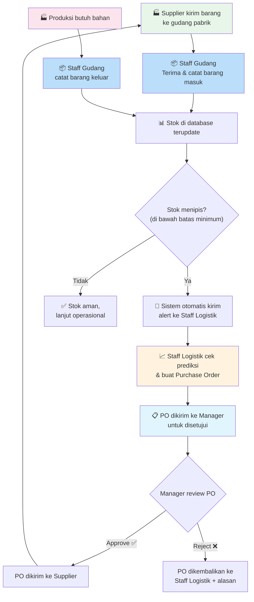
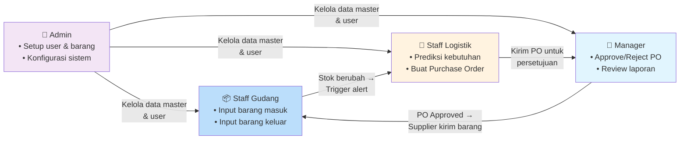

# Penjelasan Logika Sistem PWI Industrial OS

## Konteks: Apa Ini?

PWI Industrial OS adalah **sistem manajemen gudang** untuk **PT. Parkland World Indonesia** — sebuah pabrik sepatu. Bayangkan pabrik ini punya gudang besar yang menyimpan bahan baku seperti lem, kain, karet, benang, dll. Sistem ini mengatur **siapa mengerjakan apa** di gudang tersebut.

---

## Analogi Sederhana

Bayangkan gudang seperti **dapur restoran besar**:

| Peran di Restoran | Peran di Sistem | Tugas |
|---|---|---|
| **Tukang gudang** yang terima & keluarkan bahan | **Staff Gudang** | Catat bahan masuk & keluar |
| **Kepala dapur** yang pesan bahan ke supplier | **Staff Logistik** | Prediksi kebutuhan & buat pesanan |
| **Manajer restoran** yang approve pembelian | **Manager** | Review laporan & setujui pesanan |
| **Pemilik restoran** yang kelola semuanya | **Admin** | Kelola user, barang, dan konfigurasi |

---

## Alur Kerja Harian (Cerita)



---

## Detail Per Role

### 1. 📦 Staff Gudang — "Petugas Lapangan"

> Orang yang **secara fisik** berada di gudang, menerima dan mengeluarkan barang.

| Halaman | Apa yang Dilakukan | Contoh Nyata |
|---|---|---|
| **Dashboard Gudang** | Lihat rangkuman hari ini: berapa barang masuk, berapa keluar | "Hari ini ada 5 penerimaan, 3 pengeluaran" |
| **Input Stok Masuk** | Catat barang yang baru datang dari supplier | "Lem Industrial V3, 500 liter, dari PO-2026-0421" → klik Simpan → stok bertambah |
| **Input Stok Keluar** | Catat barang yang diambil untuk produksi | "Line produksi 4 minta Kain Mesh 200 meter" → klik Simpan → stok berkurang |
| **Data Barang** | Lihat daftar semua barang di gudang (read-only) | "Cek stok Rubber Compound sisa berapa" |
| **Riwayat Transaksi** | Lihat semua catatan masuk/keluar yang pernah dilakukan | "Minggu ini ada transaksi apa saja?" |

**Logika di backend:**
- Saat **Stok Masuk**: `items.current_stock += quantity`
- Saat **Stok Keluar**: `items.current_stock -= quantity`
- Setiap transaksi disimpan di tabel `stock_transactions`
- Setelah update stok, sistem cek: **apakah `current_stock < minimum_stock`?** Jika ya → buat `stock_alert`

---

### 2. 🚛 Staff Logistik — "Perencana & Pengadaan"

> Orang yang **menganalisis kebutuhan** dan **membuat pesanan** ke supplier.

| Halaman | Apa yang Dilakukan | Contoh Nyata |
|---|---|---|
| **Dashboard Logistik** | Lihat overview: berapa alert stok rendah, PO pending | "Ada 14 item stok rendah, 3 PO belum disetujui" |
| **Prediksi Stok (SMA)** | Lihat prediksi kapan stok akan habis berdasarkan pola penggunaan | "Berdasarkan rata-rata 3 hari terakhir, Kain Mesh akan habis tanggal 15 April" |
| **Notifikasi Stok Rendah** | Lihat daftar barang yang stoknya menipis | "EVA Foam tinggal 240 unit — di bawah minimum 500!" |
| **Buat Purchase Order** | Buat pesanan pengadaan barang ke supplier | Isi form: Supplier = PT Indo Leather, Item = EVA Foam, Qty = 5000, Harga = Rp 25.000/unit → Submit |
| **Laporan Inventaris** | Lihat rekap stok masuk/keluar dalam periode tertentu | "Bulan April: total masuk 42.850, total keluar 38.120" |

**Logika SMA (Simple Moving Average):**
```
Contoh SMA-3 (rata-rata 3 hari terakhir):

Pengeluaran 3 hari terakhir: 800, 920, 840
SMA-3 = (800 + 920 + 840) / 3 = 853 unit/hari

Stok sekarang: 4200 unit
Prediksi habis dalam: 4200 / 853 = 4.9 hari → Warning!
```

**Logika PO:**
- Staff Logistik buat PO → status = `pending`
- PO otomatis muncul di halaman Manager untuk di-approve
- Notifikasi dikirim ke Manager

---

### 3. 👔 Manager — "Pengambil Keputusan"

> Orang yang **mereview, menyetujui, dan memonitor** tanpa melakukan input operasional.

| Halaman | Apa yang Dilakukan | Contoh Nyata |
|---|---|---|
| **Dashboard Eksekutif** | Lihat rangkuman keseluruhan: total stok, tren, aktivitas | "Stok total 125.490 unit, ada 24 alert, 18 PO pending" |
| **Laporan Inventaris** | Review laporan stok dengan filter tanggal & kategori | "Filter bulan April → Lihat item mana yang paling banyak keluar" |
| **Grafik Prediksi Stok** | Lihat prediksi visual untuk mengambil keputusan strategis | "Kalau tren ini terus, minggu depan 8 item akan kehabisan stok" |
| **Persetujuan PO** | Review & approve/reject Purchase Order dari Staff Logistik | Lihat PO-2026-0421 dari Staff Logistik → cek item, qty, harga → klik **Approve** ✅ atau **Reject** ❌ + alasan |
| **Ekspor Data** | Download laporan dalam format PDF/Excel | "Export laporan inventaris April ke Excel untuk meeting direksi" |

**Logika Approve/Reject PO:**
- **Approve**: `purchase_orders.status = 'approved'`, `approved_by = manager_id`
- **Reject**: `purchase_orders.status = 'rejected'`, `rejection_reason = "Budget tidak cukup"`
- Notifikasi dikirim balik ke Staff Logistik

---

### 4. 🔧 Admin — "Pengelola Sistem"

> Orang yang **mengkonfigurasi sistem** dan mengelola data master.

| Halaman | Apa yang Dilakukan | Contoh Nyata |
|---|---|---|
| **Dashboard Admin** | Lihat statistik sistem: total user, total barang, total transaksi | "Sistem punya 25 user aktif, 150 SKU barang" |
| **Manajemen User** | Tambah/edit/hapus akun user & assign role | "Buat akun baru: Budi, email budi@pwi.co.id, role = staff_gudang" |
| **Master Data Barang** | CRUD barang/material yang ada di gudang | "Tambah item baru: SKU-EV-MS4, EVA Foam Midsole L4, kategori Outsole, minimum stok 500" |
| **Log Aktivitas** | Lihat audit trail semua aksi yang dilakukan di sistem | "Siapa yang approve PO-2026-0421? Kapan? Jam berapa?" |
| **Konfigurasi Sistem** | Atur parameter sistem | "Set batas minimum stok default = 30%, prefix PO = 'PO-2026'" |

**Logika CRUD User:**
- Admin buat user → set role (admin/manager/staff_gudang/staff_logistik)
- Role menentukan menu sidebar yang muncul dan halaman yang bisa diakses

---

## Hubungan Antar Role (Ringkasan)



---

## Tabel Database yang Terlibat Per Aksi

| Aksi | Tabel yang Terpengaruh |
|------|----------------------|
| Staff Gudang input stok masuk | `stock_transactions` (INSERT), `items` (UPDATE current_stock +), `stock_alerts` (mungkin RESOLVE) |
| Staff Gudang input stok keluar | `stock_transactions` (INSERT), `items` (UPDATE current_stock -), `stock_alerts` (mungkin CREATE baru) |
| Staff Logistik buat PO | `purchase_orders` (INSERT), `purchase_order_items` (INSERT), `notifications` (INSERT ke manager) |
| Manager approve PO | `purchase_orders` (UPDATE status & approved_by), `notifications` (INSERT ke logistik) |
| Admin tambah user | `users` (INSERT) |
| Admin tambah barang | `items` (INSERT) |
| Semua aksi | `activity_logs` (INSERT — audit trail otomatis) |
